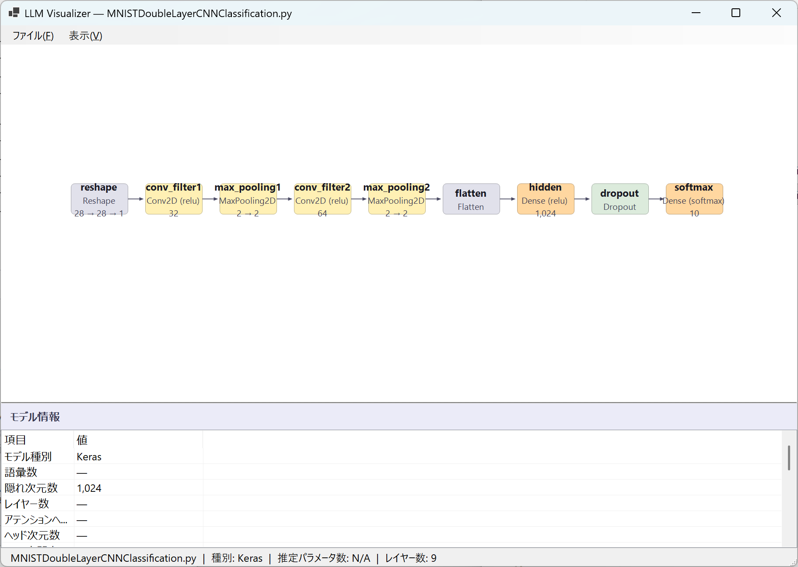

# LLM Visualizer

**Neural Network Architecture Visualizer** — A Windows desktop application that reads model structures from Python source files (.py), HuggingFace config.json, and GGUF files, and visualizes them in a left-to-right flow diagram.

> 🌐 **English** | [日本語](docs/README_ja.md)

<p align="center">
  
  <br>
  <em>Visualization of a Keras CNN model (MNISTDoubleLayerCNNClassification.py)</em>
</p>

---

## ✨ Features

| Feature | Description |
|---------|-------------|
| **Multi-Framework Support** | PyTorch, TensorFlow/Keras, JAX/Flax, JAX/Haiku, PaddlePaddle, MindSpore |
| **Multiple File Formats** | Python (.py), JSON (config.json), GGUF (.gguf) |
| **Auto Framework Detection** | Automatically identifies the framework from import statements |
| **Layer Visualization** | Left-to-right architecture diagram rendered with GDI+ |
| **Container Expansion** | Expands child layers of ModuleList / Sequential / ModuleDict |
| **Sub-class Expansion** | Recursively expands user-defined sub-module classes |
| **Metadata Extraction** | Auto-estimates VocabSize, HiddenSize, NumAttentionHeads, etc. |
| **Zoom & Pan** | Mouse wheel to zoom, drag to pan |
| **PNG Export** | Save architecture diagrams as high-resolution PNG |
| **Drag & Drop** | Drop files onto the window for instant loading |

---

## 🏗️ Supported Frameworks

### PyTorch
- Parses `nn.Module` subclass `__init__()` / `forward()` methods
- Supports `nn.ModuleList`, `nn.ModuleDict`, `nn.Sequential` (+ `OrderedDict`)
- Expands internal structure of `nn.TransformerEncoder` / `nn.TransformerDecoder`
- Detects functional activations such as `F.relu`, `torch.relu`

### TensorFlow / Keras
- Sequential API (`model.add()` / inline definition)
- Functional API (`layers.Dense(...)(x)`)
- Extracts activation arguments like `activation='relu'`

### JAX / Flax
- Layer definitions via `setup()` method
- Inline definitions with `@nn.compact` decorator (`nn.Dense(features=128)(x)`)
- Normalizes Flax-specific types (`Embed` → `Embedding`, `SelfAttention` → `MultiheadAttention`)
- Keyword-based dimension extraction (`features=`, `num_heads=`, `num_embeddings=`)

### JAX / Haiku
- Parses `hk.Module` subclass `__init__()` / `__call__()` methods
- Recognizes layers such as `hk.Linear`, `hk.Embed`, `hk.LayerNorm`

### PaddlePaddle
- Parses `nn.Layer` subclass `__init__()` / `forward()` methods
- Supports `nn.LayerList` containers
- Recognizes layers with `paddle.nn.` prefix

### MindSpore
- Parses `nn.Cell` subclass `__init__()` / `construct()` methods
- Supports `nn.CellList` containers
- Recognizes layers with `mindspore.nn.` / `ms.nn.` prefix

---

## 🚀 Requirements

| Requirement | Version |
|-------------|---------|
| **OS** | Windows 10 / 11 (x64) |
| **.NET** | .NET 10 Preview or later |

> [!NOTE]
> If the .NET 10 runtime is not installed, download it from the [official download page](https://dotnet.microsoft.com/download/dotnet/10.0).

---

## 📦 Installation & Running

### Using Release Binaries

1. Download the latest ZIP from the [Releases](https://github.com/freyWylfred/LLMVisualizer/releases) page
2. Extract to any folder
3. Run `LLMVisualizer.exe`

### Building from Source

```bash
git clone https://github.com/freyWylfred/LLMVisualizer.git
cd LLMVisualizer
dotnet build
dotnet run --project LLMVisualizer
```

---

## 🧪 Testing

50 unit tests (MSTest) verify the core functionality.

```bash
dotnet test
```

### Test Coverage

| Category | Tests | Coverage |
|----------|-------|----------|
| PyTorch | 14 | GPT, Transformer, CNN, Sequential, LSTM |
| TensorFlow | 2 | Sequential, Activation |
| JAX/Flax | 8 | setup(), @nn.compact, Embed, Dense, SelfAttention |
| JAX/Haiku | 5 | Parse, Embed, Linear, Framework, CallOrder |
| PaddlePaddle | 5 | Parse, Embed, Framework, Forward, SubClass |
| MindSpore | 6 | Parse, Embed, Framework, Construct, SubClass, Metadata |
| Edge Cases | 4 | Empty file, No module, Malformed parens, Missing file |
| JSON/GGUF | 4 | Missing file, Invalid JSON, Invalid magic, Truncated |
| Utilities | 2 | FormatParameters |

---

## 📁 Project Structure

```
LLMVisualizer/
├── LLMVisualizer/                # Main application
│   ├── Program.cs                # Entry point
│   ├── Form1.cs                  # Main form (file loading, D&D, UI)
│   ├── Form1.Designer.cs         # Form designer
│   ├── ArchitecturePanel.cs      # GDI+ custom drawing panel
│   ├── LLMModel2.cs              # Model/Parser (Python, JSON, GGUF)
│   ├── LLMVisualizer.csproj      # Project file
│   └── TestData/                 # Test Python samples
│       ├── test_pytorch_basic.py
│       ├── test_pytorch_transformer.py
│       ├── test_pytorch_cnn.py
│       ├── test_pytorch_sequential.py
│       ├── test_pytorch_lstm.py
│       ├── test_tf_sequential.py
│       ├── test_flax_setup.py
│       ├── test_flax_compact.py
│       ├── test_haiku.py
│       ├── test_paddle.py
│       ├── test_mindspore.py
│       ├── test_empty.py
│       ├── test_no_module.py
│       └── test_malformed.py
├── LLMVisualizer.Tests/          # Unit tests (MSTest)
│   ├── ParserTests.cs            # 50 test cases
│   ├── LLMVisualizer.Tests.csproj
│   └── TestData/                 # Test data copy
├── docs/                         # Documentation
│   ├── README_ja.md              # Japanese README
│   └── screenshot.png            # Application screenshot
├── LLMVisualizer.slnx            # Solution file
├── LICENSE                       # MIT License
└── README.md                     # This file (English)
```

---

## 🎨 Layer Color Coding

| Color | Layer Types |
|-------|-------------|
| 🔵 Blue | Embedding, Embed, Input |
| 🟣 Purple | LayerNorm, RMSNorm, BatchNorm |
| 🟢 Green | MultiheadAttention, Transformer, LSTM, GRU |
| 🟠 Orange | Linear, Dense, DenseGeneral |
| 🔴 Red | Output / Head layers |
| 🟡 Yellow | Conv, Pool |
| Gray-Green | ReLU, GELU, Dropout, and other activations |
| ⬜ Gray | Others |

---

## 📝 Usage

1. **Open a file**: Menu "File → Open" or drag & drop a file onto the window
2. **Supported formats**:
   - `.py` — Python source files (PyTorch, TensorFlow, Flax, Haiku, Paddle, MindSpore)
   - `.json` — HuggingFace config.json
   - `.gguf` — GGUF model files
3. **Controls**:
   - **Zoom**: Mouse wheel or menu "View → Zoom In / Zoom Out"
   - **Pan**: Mouse drag
   - **Reset**: Menu "View → Reset Zoom"
4. **Export**: Menu "File → Export PNG" to save a high-resolution image

---

## 🤝 Contributing

Issues and Pull Requests are welcome!

1. Fork this repository
2. Create a feature branch (`git checkout -b feature/amazing-feature`)
3. Commit your changes (`git commit -m 'Add amazing feature'`)
4. Push to the branch (`git push origin feature/amazing-feature`)
5. Open a Pull Request

---

## 📜 License

This project is licensed under the [MIT License](LICENSE).

---

## 🙏 Acknowledgments

- [.NET 10](https://dotnet.microsoft.com/) — Microsoft
- [Windows Forms](https://learn.microsoft.com/dotnet/desktop/winforms/) — GDI+ based UI framework
